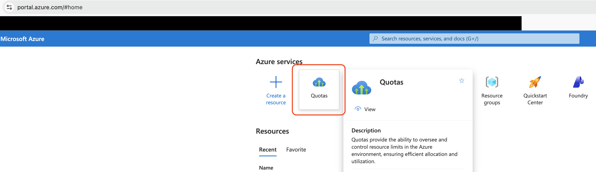
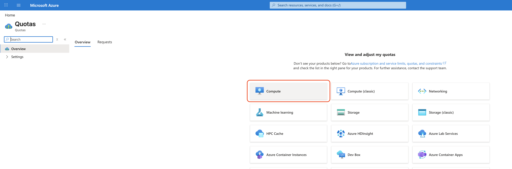
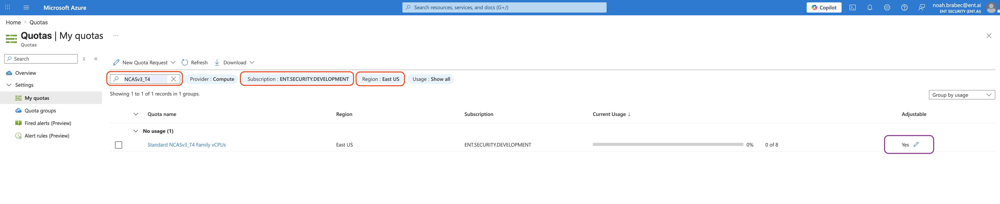
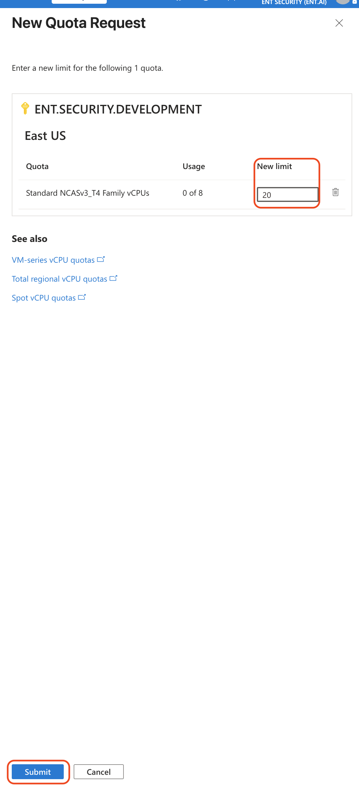
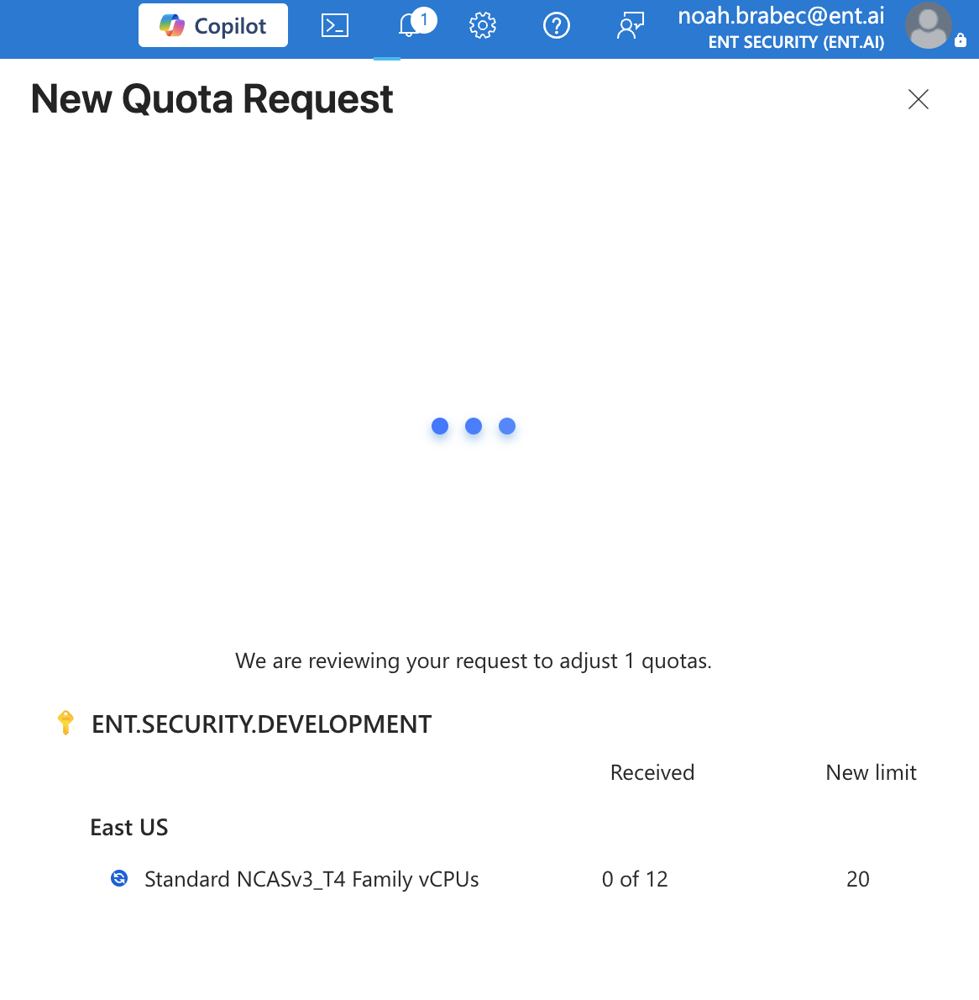
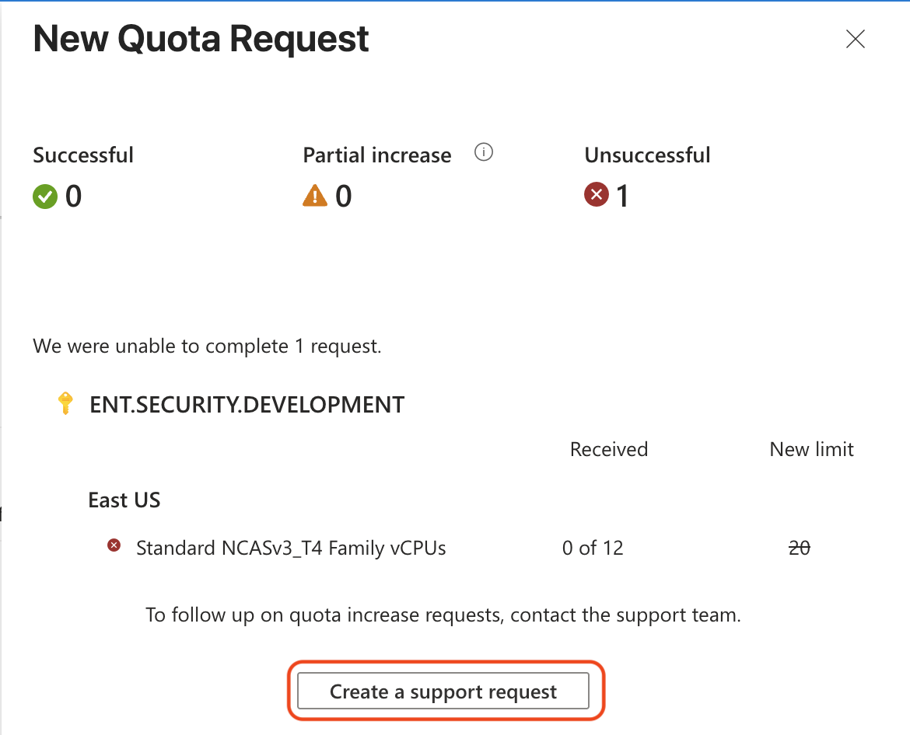
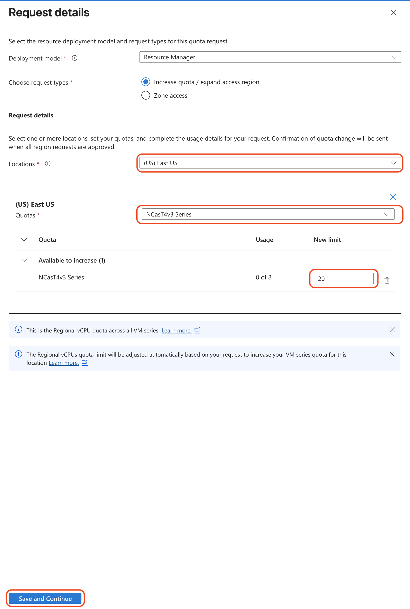

## How to request GPU quota on Azure

### Navigate to the portals quota request page at https://portal.azure.com/#view/Microsoft_Azure_Capacity/QuotaMenuBlade/~/myQuotas

### Filter the table to your desired region, use the quota SKU required.

### After finding the correct entry above, click the adjust pencil (purple box) to open the submission page. Enter the amount of quota desired.

### Click submit. It will bring up a loading page, let it finish. If it succeeds, congrats! You're done!

### If it fails as shown below (this is the expected path) open a support ticket with the Azure Portal team

### Ensure the entries for the ticket are correct. Then, you will have to check your email for the quota processing. This can take up to 2 or 3 days to complete.

